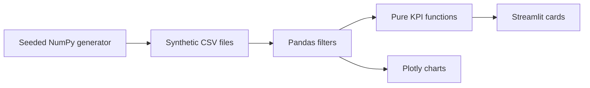

# Executive KPI Dashboard

An independent consulting portfolio project by Lavonte Jones: a management reporting dashboard for fictional **Cedarline Home Services**. All data is generated locally with seed 42; there are no client exports or integrations.

## Business questions
Revenue trend, gross margin, operating cash proxy, spending coverage, pipeline value, and close time. Four tabs cover revenue, cash, pipeline, and technician operations. Base, downside, and upside scenarios demonstrate operating leverage.

## Run locally
Python 3.12 or newer:
```sh
python -m venv .venv
source .venv/bin/activate
python -m pip install -r requirements.txt
python src/data_gen.py
python -m streamlit run app.py
```
On Windows activate `.venv\Scripts\activate` instead. Open the local URL printed by Streamlit. No credentials or environment variables are required, so an `.env.example` is unnecessary.

## Demo
The committed CSVs make the app runnable immediately. Choose the final 12 months, compare Base with Downside, and select a region. See [demo walkthrough](docs/DEMO.md) and [sample-data preview](docs/preview.svg).

## Architecture

`src/data_gen.py` owns the data provenance; `src/kpis.py` owns formulas; `app.py` owns presentation. Tests use hand-calculated fixtures and Streamlit's app runner.

## Validate
```sh
python -m unittest discover -s tests -v
```
CI repeats these checks. [Audit notes](docs/AUDIT.md) describe publication checks and remaining settings.

## Definitions and limitations
Gross margin = (revenue − COGS) / revenue. Net Cash Flow is revenue − COGS − posted overhead: an accrual operating proxy, not reconciled bank movement. Runway is cash divided by average weekly COGS plus overhead, so it measures total-spend coverage rather than net burn. Monthly overhead posts on the first day; partial-month comparisons can distort results.

Region filters allocate company overhead and cash by each region's full-dataset revenue share; this is illustrative, not segment accounting. Pipeline remains a snapshot as of September 30, 2026, regardless of the date filter. Scenario multipliers affect headline operating metrics; charts and cash balances remain historical. Technician utilization uses an illustrative 22 jobs/month denominator and caps display at 120%. Synthetic data, assumptions, and thresholds require replacement and validation for a real engagement. No accounting, investment, or production assurance is offered.

## License
MIT, retaining the repository's existing license. Third-party packages retain their own licenses. No JONESYS assets or client material are used.
